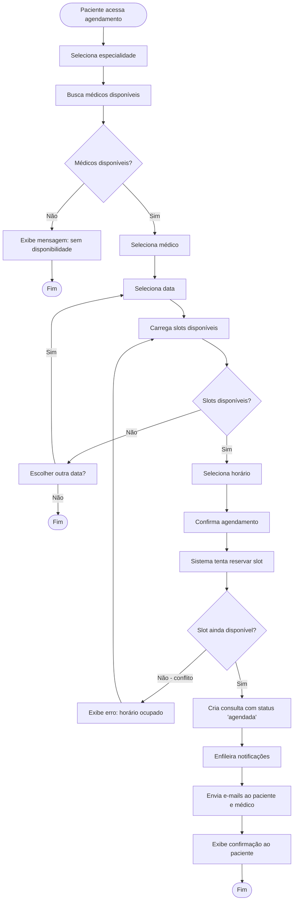
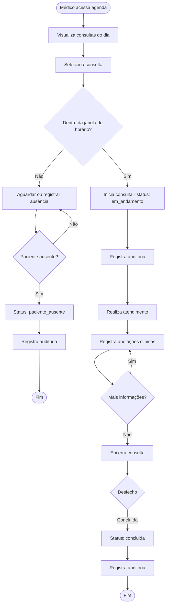
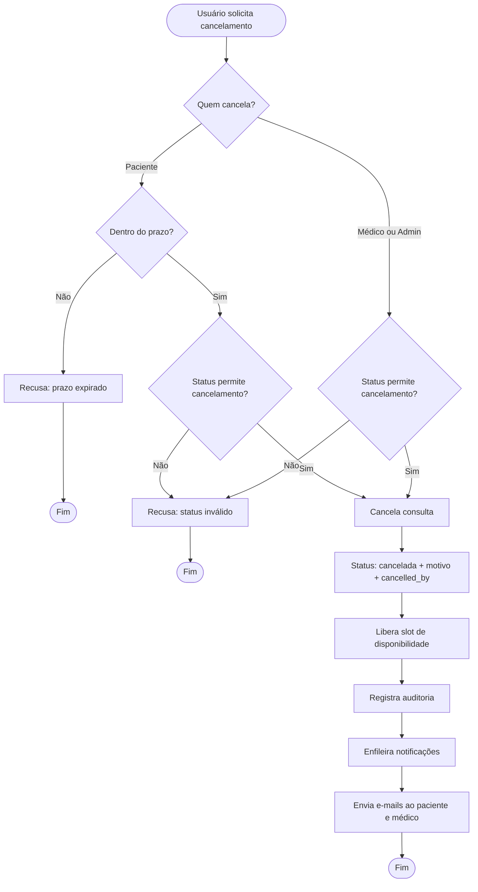

# Diagramas de Atividades — Sistema de Telemedicina

**Data:** 2026-10-09
**Formato:** Mermaid
**Status:** Implementado (Fase 5)

---

## AT-01 — Fluxo de Agendamento de Consulta

---

## AT-02 — Fluxo de Realização de Consulta

---

## AT-03 — Fluxo de Cancelamento

