```mermaid
graph TB
    subgraph Atores
        A[👤 Administrador]
        M[👨‍⚕️ Médico]
        P[👤 Paciente]
        S[⚙️ Sistema]
    end

    subgraph Sistema de Telemedicina
        subgraph Autenticação
            UC01[Registrar-se]
            UC02[Fazer Login]
            UC03[Verificar E-mail]
            UC04[Recuperar Senha]
            UC05[Fazer Logout]
        end

        subgraph Gerenciamento de Usuários
            UC06[Gerenciar Usuários]
            UC07[Editar Perfil]
        end

        subgraph Médicos e Especialidades
            UC08[Cadastrar Médico]
            UC09[Editar/Desativar Médico]
            UC10[Gerenciar Especialidades]
        end

        subgraph Disponibilidade
            UC11[Configurar Horários]
            UC12[Bloquear Horários]
        end

        subgraph Agendamento
            UC13[Buscar Disponibilidade]
            UC14[Agendar Consulta]
            UC15[Cancelar Consulta]
            UC16[Reagendar Consulta]
        end

        subgraph Consulta
            UC17[Iniciar Consulta]
            UC18[Registrar Anotações]
            UC19[Encerrar Consulta]
        end

        subgraph Histórico e Painéis
            UC20[Ver Histórico de Consultas]
            UC21[Ver Dashboard]
        end

        subgraph Notificações e Auditoria
            UC22[Enviar Notificações]
            UC23[Registrar Auditoria]
            UC24[Ver Logs de Auditoria]
        end
    end

    %% Administrador
    A --> UC06
    A --> UC07
    A --> UC08
    A --> UC09
    A --> UC10
    A --> UC12
    A --> UC15
    A --> UC21
    A --> UC24
    A --> UC02
    A --> UC05

    %% Médico
    M --> UC02
    M --> UC05
    M --> UC07
    M --> UC11
    M --> UC12
    M --> UC15
    M --> UC17
    M --> UC18
    M --> UC19
    M --> UC20
    M --> UC21

    %% Paciente
    P --> UC01
    P --> UC02
    P --> UC03
    P --> UC04
    P --> UC05
    P --> UC07
    P --> UC13
    P --> UC14
    P --> UC15
    P --> UC16
    P --> UC20
    P --> UC21

    %% Sistema
    S --> UC22
    S --> UC23

    %% Inclusões
    UC14 -.include.-> UC13
    UC16 -.include.-> UC15
    UC16 -.include.-> UC14
    UC17 -.include.-> UC02
    UC18 -.include.-> UC17
    UC19 -.include.-> UC17
```

# Diagrama de Casos de Uso — Sistema de Telemedicina

**Data:** 2026-10-09
**Formato:** Mermaid
**Status:** Implementado (Fase 5)

---

---

## Narrativa dos principais casos de uso

### CU-01 — Registrar-se (Paciente)
O visitante preenche o formulário de registro com nome, e-mail e senha. O sistema valida os dados, cria a conta com perfil `paciente` e envia e-mail de verificação. O paciente não pode agendar consultas até verificar o e-mail.

### CU-02 — Fazer Login
O usuário informa e-mail e senha. O sistema valida as credenciais, emite um token de acesso Sanctum e redireciona para o painel do perfil correspondente.

### CU-03 — Agendar Consulta (Paciente)
O paciente seleciona uma especialidade, visualiza os médicos disponíveis, escolhe um slot de horário e confirma o agendamento. O sistema reserva o slot atomicamente (prevenindo conflitos) e envia e-mails de confirmação ao paciente e ao médico.

### CU-04 — Configurar Disponibilidade (Médico)
O médico define dias da semana, horários de início e fim e duração padrão das consultas. O sistema gera os slots disponíveis conforme a configuração.

### CU-05 — Realizar Consulta (Médico)
O médico inicia a consulta (muda status para `em_andamento`), registra anotações clínicas durante o atendimento e encerra a consulta (muda status para `concluida` ou `paciente_ausente`).

### CU-06 — Cancelar Consulta
Paciente, médico ou administrador cancela uma consulta. O sistema valida o prazo permitido para cancelamento pelo paciente, muda o status para `cancelada`, libera o slot e envia notificações aos envolvidos.
