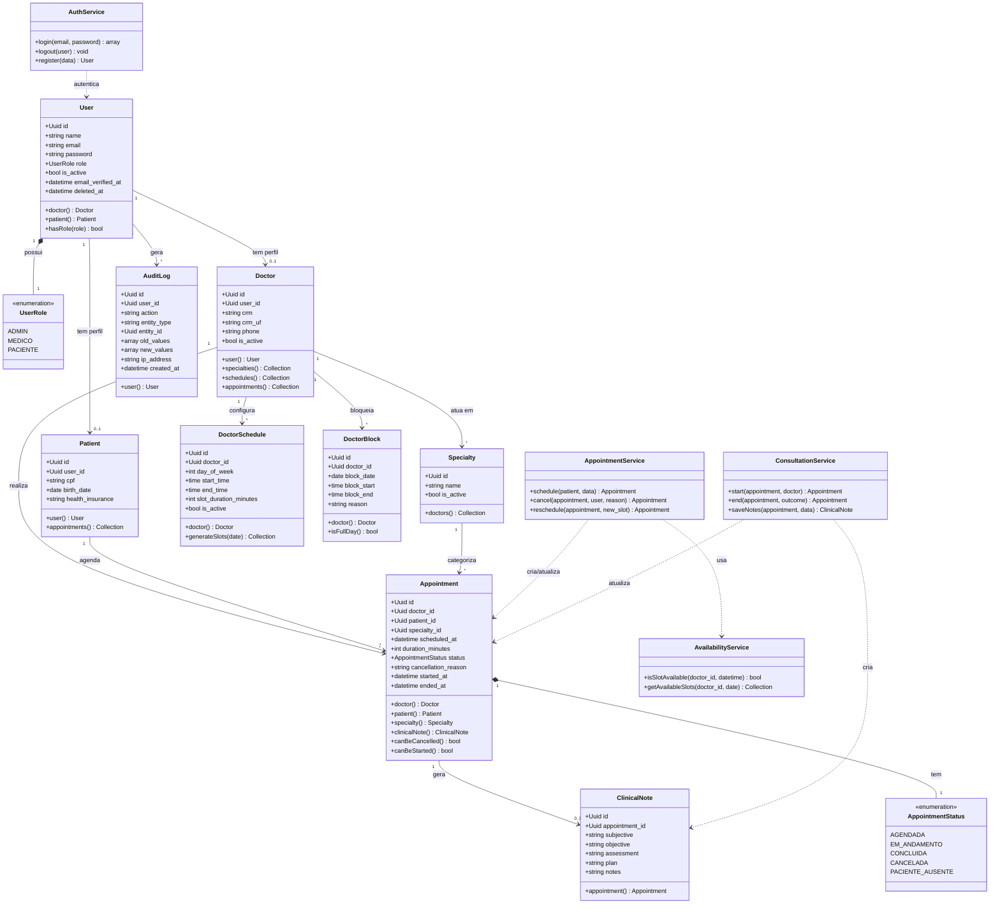

# Diagrama de Classes de Domínio — Sistema de Telemedicina

**Data:** 2026-10-09
**Formato:** Mermaid
**Status:** Proposta inicial — aguardando aprovação

> Representa as principais classes de domínio, não todas as classes do framework.

---

