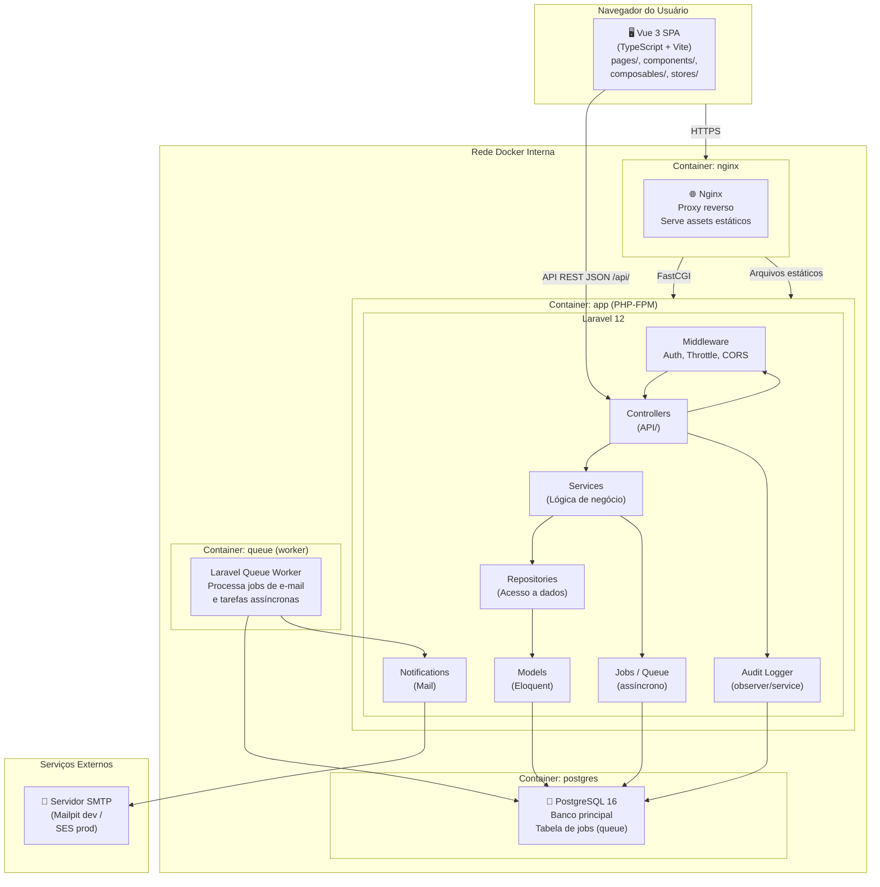

# Diagrama de Componentes — Sistema de Telemedicina

**Data:** 2026-10-09
**Formato:** Mermaid
**Status:** Implementado (Fase 5)

---

## Visão de alto nível (C4 — Nível 2: Containers)



---

## Visão detalhada — Camadas do Laravel

```mermaid
graph LR
    subgraph HTTP["Camada HTTP"]
        REQ["FormRequest
        Validação de entrada"]
        CTRL["Controller
        Roteamento HTTP"]
        RES["API Resource
        Formato de saída"]
    end

    subgraph Business["Camada de Negócio"]
        SVC["Service
        Regras de negócio
        Orquestração"]
        POLICY["Policy
        Autorização por recurso"]
    end

    subgraph Data["Camada de Dados"]
        MODEL["Model
        Eloquent ORM
        Relacionamentos / Scopes"]
    end

    subgraph Support["Suporte"]
        ENUM["Enum
        AppointmentStatus, UserRole"]
        NOTIF["Notification
        AppointmentBooked
        AppointmentCancelled"]
    end

    REQ -->|dados validados| CTRL
    CTRL -->|autoriza via| POLICY
    CTRL -->|chama| SVC
    SVC -->|Eloquent direto| MODEL
    SVC -->|dispara (queued)| NOTIF
    CTRL -->|formata via| RES
```

---

## Organização dos módulos

| Módulo | Controller | Service | Model(s) |
|---|---|---|---|
| Auth | `AuthController` | `AuthService` | `User` |
| Users | `UserController` | `UserService` | `User` |
| Doctors | `DoctorController` | `DoctorService` | `Doctor`, `Specialty` (pivot) |
| Patients | `PatientController` | `PatientService` | `Patient` |
| Specialties | `SpecialtyController` | `SpecialtyService` | `Specialty` |
| Availability | `AvailabilityController` | `AvailabilityService` | `DoctorSchedule`, `DoctorBlock` |
| Appointments | `AppointmentController` | `AppointmentService` | `Appointment` |
| Dashboard | `DashboardController` | `DashboardService` | `Appointment`, `Doctor`, `Patient` |

> **Nota:** O padrão Repository não foi adotado no MVP. Os Services utilizam Eloquent diretamente, o que é suficiente para a escala atual. Repositories podem ser introduzidos em futuras iterações se houver necessidade de abstração de fonte de dados.
