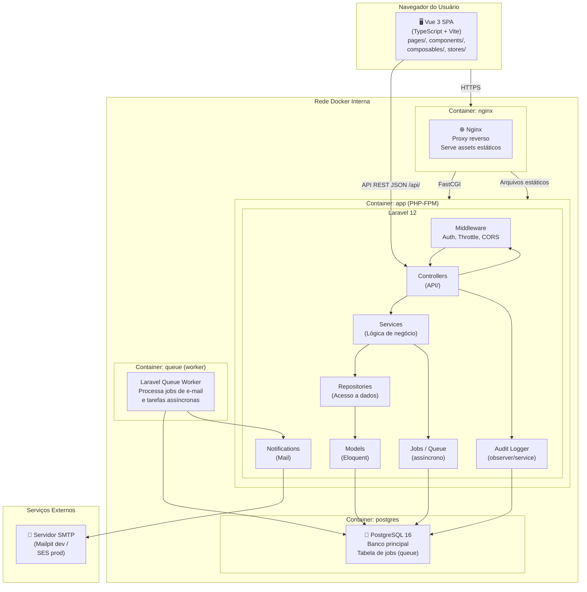
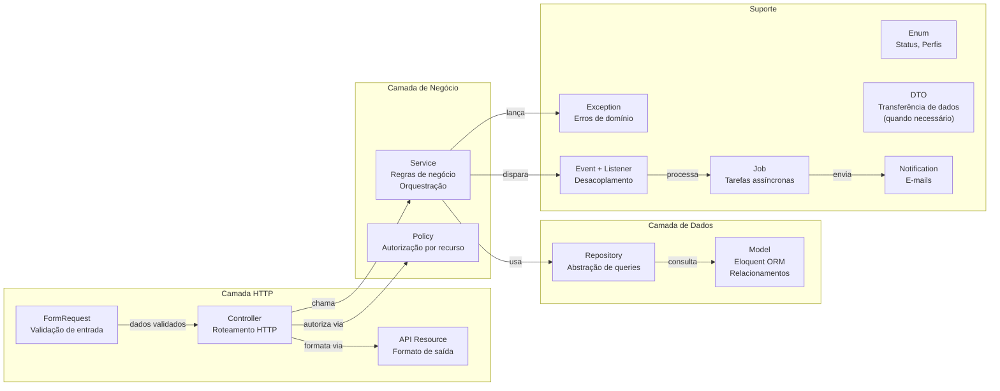

# Diagrama de Componentes — Sistema de Telemedicina

**Data:** 2026-10-09
**Formato:** Mermaid
**Status:** Proposta inicial — aguardando aprovação

---

## Visão de alto nível (C4 — Nível 2: Containers)

---

## Visão detalhada — Camadas do Laravel

---

## Organização dos módulos

| Módulo | Controller | Service | Repository | Model |
|---|---|---|---|---|
| Auth | `AuthController` | `AuthService` | — | `User` |
| Users | `UserController` | `UserService` | `UserRepository` | `User` |
| Doctors | `DoctorController` | `DoctorService` | `DoctorRepository` | `Doctor`, `DoctorSpecialty` |
| Patients | `PatientController` | `PatientService` | `PatientRepository` | `Patient` |
| Specialties | `SpecialtyController` | `SpecialtyService` | `SpecialtyRepository` | `Specialty` |
| Availability | `AvailabilityController` | `AvailabilityService` | `AvailabilityRepository` | `DoctorSchedule`, `DoctorBlock` |
| Appointments | `AppointmentController` | `AppointmentService` | `AppointmentRepository` | `Appointment` |
| Consultations | `ConsultationController` | `ConsultationService` | `ConsultationRepository` | `Appointment`, `ClinicalNote` |
| Dashboard | `DashboardController` | `DashboardService` | — | (múltiplos) |
| Audit | — | `AuditService` | `AuditRepository` | `AuditLog` |
