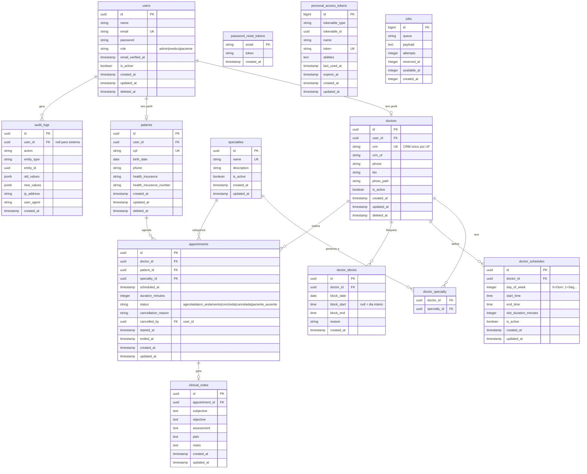

# Diagrama Entidade-Relacionamento — Sistema de Telemedicina

**Data:** 2026-10-09
**Formato:** Mermaid ER
**Status:** Proposta inicial — aguardando aprovação

---

---

## Notas sobre o modelo

1. **UUIDs** como chaves primárias em todas as tabelas principais (evita enumeração de IDs).
2. **Soft delete** (`deleted_at`) em `users`, `doctors`, `patients` para preservar histórico.
3. **Constraint única** implícita em `appointments`: combinação `(doctor_id, scheduled_at)` deve ser única para prevenir double-booking.
4. **`clinical_notes`** separado de `appointments` para facilitar controle de acesso e imutabilidade futura.
5. **`audit_logs`** com `jsonb` para flexibilidade nos valores capturados.
6. **`doctor_blocks`** com `block_start`/`block_end` nulos indica bloqueio do dia inteiro.
7. O campo `role` em `users` define o perfil de acesso (RBAC simples para MVP).
