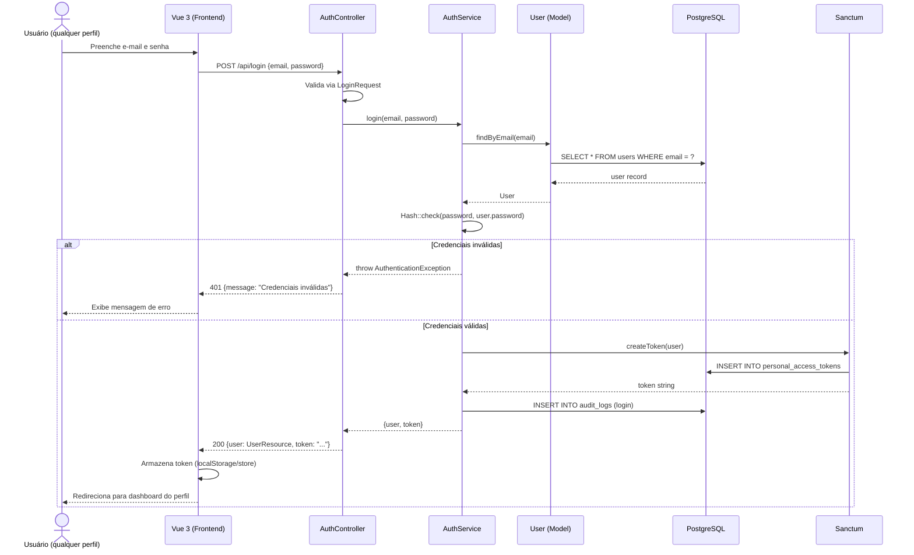
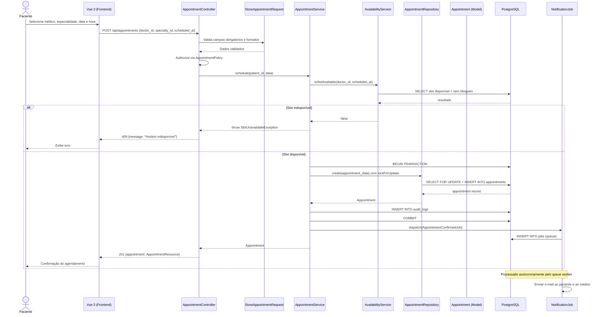
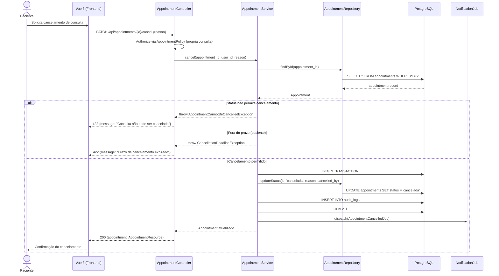
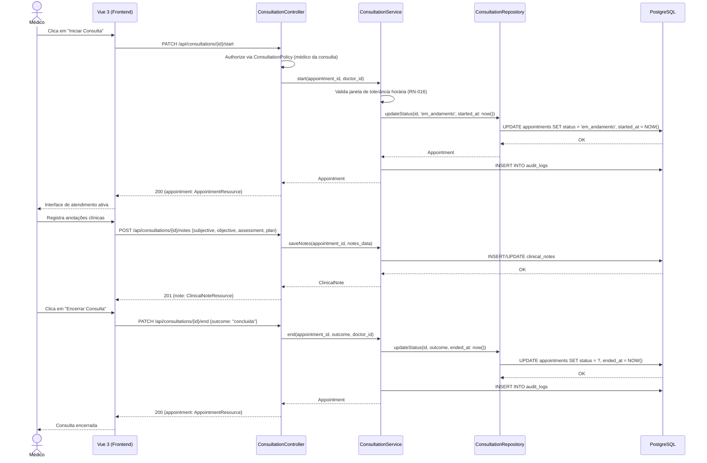

# Diagramas de Sequência — Sistema de Telemedicina

**Data:** 2026-10-09
**Formato:** Mermaid
**Status:** Proposta inicial — aguardando aprovação

---

## SEQ-01 — Autenticação (Login)

---

## SEQ-02 — Agendamento de Consulta

---

## SEQ-03 — Cancelamento de Consulta (pelo Paciente)

---

## SEQ-04 — Início e Encerramento de Consulta (Médico)

